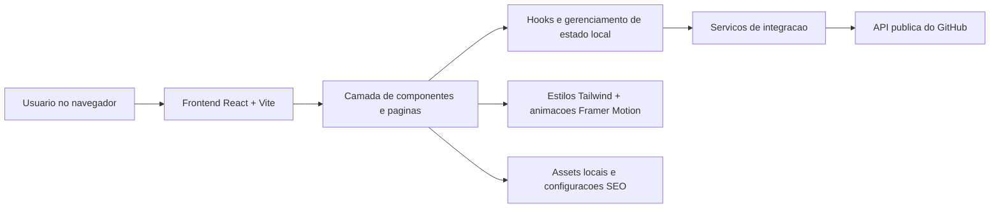

## 1. Desenho da Arquitetura


## 2. Descricao de Tecnologias
- Frontend: React 18 + Vite + JavaScript
- Estilizacao: Tailwind CSS com tokens visuais customizados e utilitarios para glassmorphism, glow e gradientes
- Animacoes: Framer Motion para reveals, transicoes de secoes, menu mobile e loading screen
- Icones: React Icons
- HTTP: Axios para consumo da API do GitHub
- Ferramentas auxiliares: hooks customizados para tema, scroll e consulta de repositorios

## 3. Definicao de Rotas
| Rota | Objetivo |
|------|----------|
| / | Renderizar a landing page completa com todas as secoes do portfolio |

## 4. Definicoes de API
Como o projeto utiliza apenas consumo de API publica externa, nao ha backend proprio nesta fase.

### 4.1 Contrato de Consumo do GitHub
```ts
export interface GitHubRepo {
  id: number;
  name: string;
  description: string | null;
  html_url: string;
  homepage: string | null;
  topics: string[];
  language: string | null;
  stargazers_count: number;
  updated_at: string;
  fork: boolean;
}
```

### 4.2 Requisicao Externa
- Metodo: `GET`
- Endpoint: `https://api.github.com/users/douradosD/repos`
- Tratamento: ordenar por atualizacao recente, remover forks quando apropriado, limitar quantidade exibida e mapear dados ausentes para estados visuais elegantes.

## 5. Estrutura de Pastas Planejada
| Caminho | Responsabilidade |
|---------|------------------|
| src/components | Componentes visuais reutilizaveis por secao e layout |
| src/pages | Pagina principal do portfolio |
| src/services | Integracao com GitHub e utilitarios de dados |
| src/hooks | Hooks para tema, cursor, scroll reveal e comportamento responsivo |
| src/assets | Foto profissional, ilustracoes, favicons e imagens do projeto |
| src/styles | Estilos globais, camadas utilitarias e efeitos especiais |

## 6. Modelo de Estado e Dados
### 6.1 Estado de Interface
- Tema atual: dark como padrao, com suporte a alternancia de modo.
- Estado do menu mobile: aberto/fechado com bloqueio de scroll quando necessario.
- Estado de carregamento inicial: exibir loading screen animada.
- Estado dos projetos: carregando, sucesso, vazio e erro.

### 6.2 Estrategia de Dados
- Dados estaticos: apresentacao, tecnologias, formacao e contatos definidos localmente para garantir controle editorial.
- Dados dinamicos: repositorios vindos da API do GitHub via camada `services`.
- Fallbacks: exibir placeholders e mensagens profissionais quando a API falhar ou algum repositorio nao tiver descricao/demo.

## 7. Diretrizes de Implementacao
- Componentizacao orientada por secao para facilitar manutencao e escalabilidade.
- Tokens visuais centralizados para paleta, sombras, gradientes e efeitos de brilho.
- Responsividade baseada em breakpoints do Tailwind com composicoes especificas para mobile.
- SEO basico via `document.title`, meta description e estrutura semantica com headings coerentes.
- Acessibilidade com contraste adequado, foco visivel, labels no formulario e interacoes navegaveis por teclado.
