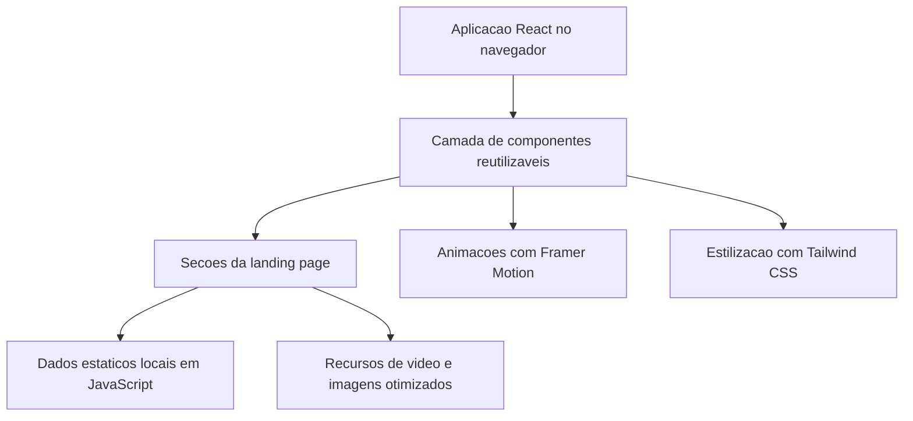

## 1. Design da Arquitetura

## 2. Descricao das Tecnologias
- Frontend: React 18 + JavaScript + Vite
- Estilizacao: Tailwind CSS
- Animacoes: Framer Motion
- Icones: lucide-react
- Gerenciamento de conteudo: dados locais em objetos/arrays para facilitar componentizacao

## 3. Definicao de Rotas
| Rota | Objetivo |
|------|----------|
| / | Landing page principal da Sync Produtora |

## 4. Definicoes de API
Nao ha backend nesta etapa. O projeto funciona como uma landing page estatica otimizada para conversao, com links externos para WhatsApp, Instagram e email.

## 5. Estrutura de Componentes
| Componente | Responsabilidade |
|------------|------------------|
| `Navbar` | Navegacao principal fixa com blur e links de ancora |
| `Hero` | Secao inicial com video de fundo, proposta de valor e CTAs |
| `Clients` | Exibicao dos segmentos atendidos |
| `Portfolio` | Grade responsiva com projetos e previews |
| `Services` | Apresentacao dos servicos ofertados |
| `Differentials` | Lista premium de argumentos de valor |
| `Testimonials` | Prova social e avaliacoes |
| `FinalCTA` | Conversao principal para WhatsApp |
| `Footer` | Contatos e encerramento da pagina |

## 6. Estrategia de Implementacao
- Estrutura componentizada em `src/components`
- Dados centralizados em um modulo unico para facilitar manutencao
- Scroll suave, secoes com IDs e navegacao por ancoras
- SEO basico via `document.title`, meta tags no `index.html` e semantica HTML
- Performance otimizada com video de background remoto, layout sem dependencias desnecessarias e animacoes responsivas

## 7. Diretrizes de Qualidade
- Codigo limpo, reutilizavel e com separacao clara entre layout e dados
- Design altamente profissional com dark mode nativo
- Acessibilidade basica com textos legiveis, contraste alto e rotulos claros em links e botoes
- Responsividade total para desktop, tablet e mobile
