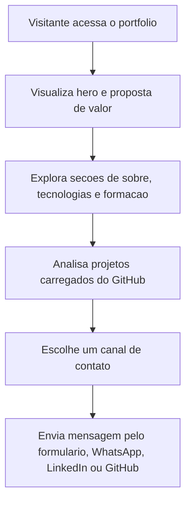

## 1. Visao Geral do Produto
Portfolio profissional premium para apresentar Eduardo Dourado como Desenvolvedor Full Stack, destacando autoridade tecnica, projetos reais e canais de contato.
- Resolve a necessidade de ter uma vitrine moderna, responsiva e persuasiva para captar clientes freelancer e oportunidades no mercado de tecnologia.
- O produto combina posicionamento profissional, identidade visual futurista e integracao dinamica com GitHub para manter a secao de projetos atualizada.

## 2. Funcionalidades Centrais

### 2.1 Modulos Principais
1. **Pagina inicial**: hero impactante, menu responsivo, loading screen, cursor customizado, dark mode, background tecnologico e CTAs principais.
2. **Secao Sobre**: narrativa profissional sobre trajetoria, evolucao tecnica, aprendizagem continua e proposta de valor.
3. **Secao Tecnologias**: grid responsivo com cards animados, icones, glow neon e barras de progresso para habilidades.
4. **Secao Formacao**: timeline moderna com animacoes de entrada para cursos e graduacao em andamento.
5. **Secao Projetos**: listagem automatica de repositorios do GitHub com nome, descricao, tecnologias, links para codigo e demo quando disponivel.
6. **Secao Contato**: formulario funcional, redes sociais, email, WhatsApp, CTA flutuante e reforco de disponibilidade profissional.

### 2.2 Detalhamento das Paginas e Modulos
| Nome da Pagina | Nome do Modulo | Descricao da Funcionalidade |
|----------------|----------------|-----------------------------|
| Landing page | Header fixo | Navegacao com links por ancora, alternancia de tema e menu mobile com animacao |
| Landing page | Hero | Destaque de nome, cargo, resumo profissional, foto, CTAs e efeitos de fundo futuristas |
| Landing page | Sobre | Texto profissional inspirador com foco em evolucao, aprendizado constante e desenvolvimento full stack |
| Landing page | Tecnologias | Cards com icones, hover premium, barras animadas e organizacao por stack |
| Landing page | Formacao | Timeline vertical com animacoes suaves e hierarquia visual para cursos e graduacao |
| Landing page | Projetos | Consulta a API do GitHub, filtros/ordenacao visual, cards com badges e botoes de acao |
| Landing page | Contato | Formulario funcional com validacao, canais sociais, CTA por WhatsApp e bloco de disponibilidade |
| Landing page | Footer | Encerramento institucional, direitos reservados e links rapidos |

## 3. Fluxo Principal
O visitante acessa a home, entende rapidamente o posicionamento profissional de Eduardo Dourado, navega por habilidades, formacao e projetos recentes, e entao converte via formulario, WhatsApp ou redes profissionais.

## 4. Design de Interface
### 4.1 Estilo Visual
- Cores principais: preto profundo, roxo escuro, roxo neon e laranja mecanico como acento energetico.
- Botoes: cantos arredondados, acabamento glassmorphism, bordas com brilho sutil e estados de hover cinematograficos.
- Tipografia: combinacao de fonte display tecnologica para titulos com fonte limpa e sofisticada para textos e interface.
- Layout: desktop-first, secoes modulares, composicao assimetrica controlada, destaque para contraste, profundidade e camadas.
- Iconografia: moderna, tecnica e consistente com linguagem visual premium.

### 4.2 Visao de Design por Modulo
| Nome da Pagina | Nome do Modulo | Elementos de UI |
|----------------|----------------|-----------------|
| Landing page | Hero | Fundo gradiente em camadas, particulas, brilho radial, foto profissional, texto animado e CTAs com motion |
| Landing page | Sobre | Bloco editorial com cards de apoio, separadores luminosos e animacoes ao scroll |
| Landing page | Tecnologias | Grid com cards transluidos, glow neon, barras de progresso, badges e microinteracoes |
| Landing page | Formacao | Linha temporal central com indicadores luminosos, cards elevados e revelacao progressiva |
| Landing page | Projetos | Cards com imagem/placeholder elegante, badges de stack, destaque de hover e botoes de GitHub/demo |
| Landing page | Contato | Painel com formulario, icones sociais, cartoes de contato e botao flutuante fixo |

### 4.3 Responsividade
- Estrategia desktop-first com adaptacoes fluidas para tablet e mobile.
- Navegacao mobile com drawer/overlay animado.
- Ajustes de grid, tipografia, espacamento e alvos de toque para manter leitura e interacao premium em telas menores.
- Performance visual balanceada para preservar animacoes suaves sem comprometer a experiencia em dispositivos medianos.

### 4.4 Direcao de Cena e Atmosfera
- Ambiente visual com profundidade escura, manchas de luz neon, ruido sutil e camadas transluidas.
- Iluminacao focada em bordas brilhantes, halos roxos e realces laranja estrategicos.
- Composicao com hierarquia forte no topo e progressao narrativa por scroll.
- Animacoes de entrada, hover e transicao pensadas para sensacao de produto premium internacional.
