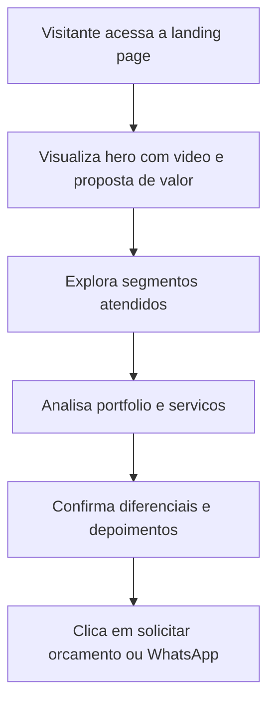

## 1. Visao Geral do Produto
Landing page premium e cinematografica para a Sync Produtora, focada em converter empresas locais interessadas em producao audiovisual profissional.
- Apresenta autoridade visual, portifolio, servicos e prova social para concessionarias, clinicas, lojas, restaurantes e empresas.
- O valor principal e transformar visitantes em contatos qualificados via WhatsApp e solicitacao de orcamento.

## 2. Funcionalidades Centrais

### 2.1 Modulo Principal
1. **Pagina inicial**: navbar com blur, hero com video, secoes de clientes, portfolio, servicos, diferenciais, depoimentos, CTA final e footer.

### 2.2 Detalhamento da Pagina
| Nome da Pagina | Nome do Modulo | Descricao da funcionalidade |
|----------------|----------------|-----------------------------|
| Pagina inicial | Navbar | Navegacao fixa com transparencia, blur, links de ancora e CTA rapido |
| Pagina inicial | Hero | Video de fundo com overlay escuro, headline impactante, texto de posicionamento e dois CTAs |
| Pagina inicial | Clientes | Cards modernos por segmento para comunicar especializacao setorial |
| Pagina inicial | Portfolio | Grid responsivo com previews, hover cinematografico e efeito glassmorphism |
| Pagina inicial | Servicos | Cards com icones para filmagem, reels, drone, edicao, social media e trafego pago |
| Pagina inicial | Diferenciais | Bloco premium com argumentos de valor e microanimacoes de destaque |
| Pagina inicial | Depoimentos | Cards elegantes com avaliacoes, nomes e percepcao de resultado |
| Pagina inicial | CTA final | Chamada persuasiva com botao grande de WhatsApp para conversao |
| Pagina inicial | Footer | Informacoes de contato, redes sociais e direitos reservados |

## 3. Fluxo Principal
O visitante chega pela pagina inicial, percebe a proposta premium no hero, valida a especializacao pelos segmentos atendidos, avalia o portfolio e os servicos, confere os diferenciais e depoimentos, e entao clica no CTA principal para iniciar contato comercial.

## 4. Design da Interface
### 4.1 Estilo Visual
- Cores principais: preto `#050505`, branco `#FFFFFF`, cinza escuro `#141414`, destaque em azul neon e roxo vibrante
- Estilo de botoes: grandes, arredondados, com brilho suave, gradientes escuros e feedback de hover
- Tipografia: Poppins para destaque, Inter para leitura e Space Grotesk para acentos visuais estrategicos
- Layout: desktop-first, secoes amplas, composicao cinematografica, camadas com blur e glassmorphism
- Iconografia: minimalista e sofisticada com `lucide-react`

### 4.2 Visao de Design da Pagina
| Nome da Pagina | Nome do Modulo | Elementos de UI |
|----------------|----------------|-----------------|
| Pagina inicial | Hero | Video full-screen, overlay, headline em alto contraste, indicadores e CTAs premium |
| Pagina inicial | Clientes | Cards em grade com bordas translúcidas, glow sutil e animacao no hover |
| Pagina inicial | Portfolio | Cards de preview com thumb, badge, gradiente, hover com zoom e camada blur |
| Pagina inicial | Servicos | Cards modulares com icones, textos curtos e microinteracoes |
| Pagina inicial | Diferenciais | Bloco editorial com lista de argumentos e destaque numerico |
| Pagina inicial | Depoimentos | Cards com aspas decorativas, estrelas e feedback animado |
| Pagina inicial | CTA final | Fundo impactante com gradientes e forte foco no botao de conversao |

### 4.3 Responsividade
- Estrategia desktop-first com adaptacao para tablet e mobile
- Empilhamento de grids e reducao progressiva de espacos em telas menores
- Botoes amplos e alvos de toque confortaveis em dispositivos moveis
- Conteudo com prioridade visual clara e leitura otimizada em dark mode
